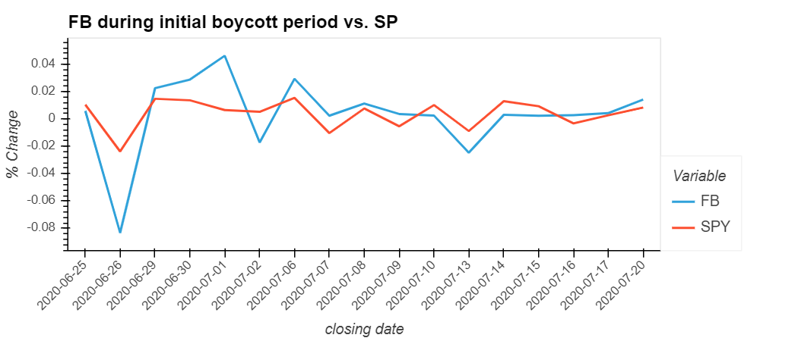

# **Facebook Boycott**

Did the Boycott work?

* Effects on FB
* Effects on Companies (by sector)

Area of analysis:

a) Short-term analysis: For last week of June and first 2 weeks of July 2020.
b) Mid-term analysis: From last week of June to the end of 2020 cf. 2019.
c) Price-to-sales ratio analysis for last available annual financials.

## Sector composition of boycotting companies:

Consumer Cyclical (15) and Consumer Defensive sector (11) companies were the largest participators this boycott.

## **FB price analysis**

Short-term: Immediate effect

We can see that FB prices dipped ~8% on June 26, 2020 and again ~2% on July 02,2020 as a result of the boycott announcements by various companies. FB fell more than the SP during this period but also recovered immediately within next few trading seesions. 

*So we can consider taking positions in FB (short term) to benefit from price dips.*

## CONSUMER CYCLICAL SECTOR
* Higher Growth Consumer Sector
* Higher Volatility
* Associated with convenience items, cars, clothing, fashion, travel & entertainment

From correlation analysis: We see that stocks LULU, VFC, ETSY, LEVI had higher corr with FB and were more senitive to price movements compared to 2019 correlation.(*corr analysis in notebook*)

During this period, we can observe from the chart that most CC stocks prices closely followed FB prices. Which could mean that this sector is considerably dependent on FB for advertisment and sales. And boycott had a negative impact on the stocks in this sector.

On further analysis, we can observe that the consumer cyclical sector change in prices was in the 0.02% +ve/-ve range in 2019. But in 2020, the change has increased to range of 0.15% resulting from factors including FB boycott and COVID lockdown.

## CONSUMER DEFENSIVE SECTOR
* Steady Growth Consumer Sector
* Lower Volatility
* Associated with groceries, food, alcohol, and bulk commodities

Unlike the consumer cyclical, consumer defensive stocks prices were not very sensitive to boycott announcements which is attributable to nature of this industry. However, some stocks like TGT, PEP, CL, HSY, CLX had higher correlation with FB price movements compared to 2019.

## Other Sectors

We can observe that sectors like Healthcare, Tech, Finance and Mix (other) did not show significant correlation to FB price movement during the boycott period.

### Healthcare Sector 
* Steady Growth Sector
* Lower Volatility 
* Associated with heatlhcare service providers, pharmaceuticals, wholesale, distribution companies, and pharmacy store chain

### Tech Sector  
* Steady Growth Sector
* High Volatility 
* Associated with software and information technology services, manufacturer, also includes a telecom.

*UPWK was removed from short term analysis as its wild price movements skewed the chart*

### Financial Sector 
* Significant Volitality during financial crisis
* Includes banking & mortgage finance companies

### Mixed Sector 
* including Energy, Basic Materials

## Price-To-Sales Ratio 

Price-to-sales ratio will show a comparison of which companies are expensive within each sector. This information alongwith price movements will help in deciding the stock picks.

We can observe that in the consumer defensive sector *PEP* and *TGT* have low PTS ratio and higher corr with FB stock price.
Further, in the consumer cyclical sector *VFC* is a better pick than *ETSY or LULU* as VFC has a lower PTS ratio than ETSY and LULU.